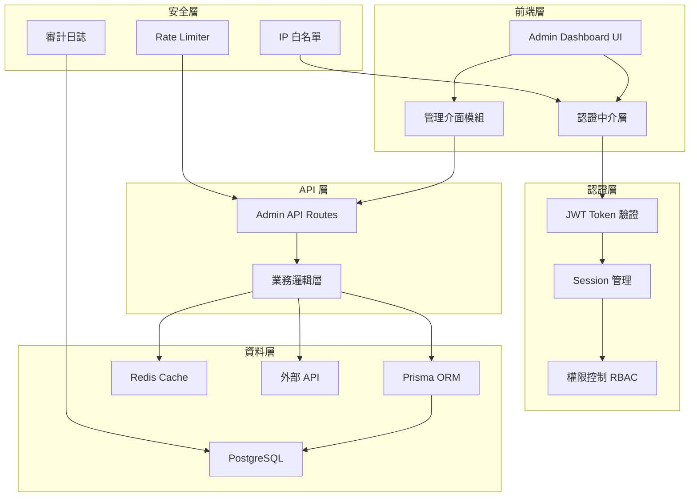

# Admin CMS 後台管理系統架構設計文件

## 目錄

1. [專案概述](#專案概述)
2. [系統架構圖](#系統架構圖)
3. [身份驗證系統](#身份驗證系統)
4. [資料庫架構設計](#資料庫架構設計)
5. [API 路由設計](#api-路由設計)
6. [功能模組設計](#功能模組設計)
7. [安全機制](#安全機制)
8. [UI/UX 設計建議](#uiux-設計建議)
9. [技術實作細節](#技術實作細節)
10. [部署與維護](#部署與維護)

---

## 專案概述

### 現有系統分析

- **技術棧**: Next.js 14 (App Router) + TypeScript + Prisma + PostgreSQL
- **部署平台**: Vercel
- **現有功能**: 圖片上傳、短網址生成、智能路由、密碼保護、過期管理
- **儲存方案**: 外部 API (meteor.today) + PostgreSQL 資料庫

### Admin CMS 目標

建立一個安全、高效的管理後台系統，提供完整的資料管理、系統監控和使用者分析功能。

---

## 系統架構圖



---

## 身份驗證系統

### 1. 雙因素認證 (2FA)

```typescript
// 認證流程設計
interface AuthFlow {
  step1: "email/username + password";
  step2: "TOTP code verification";
  step3: "JWT token generation";
  step4: "Session creation";
}
```

### 2. 管理員角色設計

```typescript
enum AdminRole {
  SUPER_ADMIN = "super_admin", // 超級管理員
  ADMIN = "admin", // 一般管理員
  MODERATOR = "moderator", // 內容管理員
  VIEWER = "viewer", // 唯讀檢視者
}

interface AdminPermissions {
  images: {
    view: boolean;
    edit: boolean;
    delete: boolean;
  };
  users: {
    view: boolean;
    manage: boolean;
  };
  system: {
    config: boolean;
    backup: boolean;
  };
}
```

### 3. Session 管理策略

- JWT Token 有效期: 15 分鐘
- Refresh Token 有效期: 7 天
- 自動續期機制
- 單一設備登入限制 (可選)

---

## 資料庫架構設計

### 1. Schema 更新

```prisma
// 現有 Mapping 模型保持不變
model Mapping {
  id        String   @id @default(cuid())
  hash      String   @unique
  filename  String
  url       String
  shortUrl  String
  createdAt DateTime @default(now())
  expiresAt DateTime?
  password  String?

  // 新增欄位
  viewCount Int      @default(0)
  isDeleted Boolean  @default(false)
  deletedAt DateTime?
  deletedBy String?

  // 關聯
  logs      AccessLog[]
  @@index([createdAt])
  @@index([isDeleted])
}

// 新增管理員模型
model Admin {
  id            String   @id @default(cuid())
  email         String   @unique
  username      String   @unique
  passwordHash  String
  role          String   @default("moderator")

  // 2FA 設定
  totpSecret    String?
  totpEnabled   Boolean  @default(false)

  // 狀態管理
  isActive      Boolean  @default(true)
  lastLoginAt   DateTime?
  lastLoginIp   String?
  failedAttempts Int     @default(0)
  lockedUntil   DateTime?

  createdAt     DateTime @default(now())
  updatedAt     DateTime @updatedAt

  // 關聯
  sessions      AdminSession[]
  auditLogs     AuditLog[]

  @@index([email])
  @@index([username])
}

// 管理員 Session
model AdminSession {
  id           String   @id @default(cuid())
  adminId      String
  token        String   @unique
  refreshToken String   @unique

  userAgent    String?
  ipAddress    String

  expiresAt    DateTime
  createdAt    DateTime @default(now())

  admin        Admin    @relation(fields: [adminId], references: [id])

  @@index([token])
  @@index([adminId])
}

// 訪問日誌
model AccessLog {
  id        String   @id @default(cuid())
  mappingId String

  ipAddress String
  userAgent String?
  referer   String?

  createdAt DateTime @default(now())

  mapping   Mapping  @relation(fields: [mappingId], references: [id])

  @@index([mappingId])
  @@index([createdAt])
}

// 審計日誌
model AuditLog {
  id        String   @id @default(cuid())
  adminId   String

  action    String   // CREATE, UPDATE, DELETE, LOGIN, etc.
  entity    String   // mapping, admin, system, etc.
  entityId  String?

  details   Json?    // 詳細變更內容
  ipAddress String

  createdAt DateTime @default(now())

  admin     Admin    @relation(fields: [adminId], references: [id])

  @@index([adminId])
  @@index([action])
  @@index([entity])
  @@index([createdAt])
}

// 系統設定
model SystemConfig {
  id        String   @id @default(cuid())
  key       String   @unique
  value     Json
  updatedAt DateTime @updatedAt
  updatedBy String?
}
```

---

## API 路由設計

### 1. 認證相關 API

```
POST   /api/admin/auth/login         # 登入
POST   /api/admin/auth/logout        # 登出
POST   /api/admin/auth/refresh       # 更新 Token
POST   /api/admin/auth/2fa/setup     # 設定 2FA
POST   /api/admin/auth/2fa/verify    # 驗證 2FA
GET    /api/admin/auth/session       # 取得當前 Session
```

### 2. 圖片管理 API

```
GET    /api/admin/images              # 列表 (分頁、篩選、搜尋)
GET    /api/admin/images/[id]         # 詳細資訊
PUT    /api/admin/images/[id]         # 編輯 (過期時間、密碼)
DELETE /api/admin/images/[id]         # 軟刪除
POST   /api/admin/images/[id]/restore # 恢復刪除
GET    /api/admin/images/[id]/logs    # 訪問日誌
```

### 3. 統計分析 API

```
GET    /api/admin/stats/overview      # 總覽統計
GET    /api/admin/stats/uploads       # 上傳統計
GET    /api/admin/stats/access        # 訪問統計
GET    /api/admin/stats/trending      # 熱門內容
GET    /api/admin/stats/storage       # 儲存空間統計
```

### 4. 管理員管理 API

```
GET    /api/admin/users               # 管理員列表
POST   /api/admin/users               # 新增管理員
PUT    /api/admin/users/[id]          # 編輯管理員
DELETE /api/admin/users/[id]          # 停用管理員
GET    /api/admin/users/[id]/logs     # 操作日誌
```

### 5. 系統管理 API

```
GET    /api/admin/system/config       # 系統設定
PUT    /api/admin/system/config       # 更新設定
GET    /api/admin/system/audit-logs   # 審計日誌
POST   /api/admin/system/backup       # 備份資料
POST   /api/admin/system/cleanup      # 清理過期資料
GET    /api/admin/system/health       # 系統健康檢查
```

---

## 功能模組設計

### 1. 儀表板模組

#### 統計卡片

- 總上傳數量
- 今日上傳量
- 活躍連結數
- 總訪問次數
- 儲存空間使用率

#### 圖表視覺化

- 7/30 天上傳趨勢圖
- 熱門圖片排行榜
- 訪問來源分析
- 使用時段分佈

### 2. 圖片管理模組

#### 列表功能

```typescript
interface ImageListFeatures {
  // 篩選選項
  filters: {
    dateRange: DateRange;
    hasPassword: boolean;
    isExpired: boolean;
    isDeleted: boolean;
  };

  // 排序選項
  sortBy: "createdAt" | "viewCount" | "filename" | "size";
  sortOrder: "asc" | "desc";

  // 批次操作
  bulkActions: {
    delete: boolean;
    export: boolean;
    updateExpiry: boolean;
  };

  // 搜尋
  search: {
    by: "hash" | "filename" | "url";
    query: string;
  };
}
```

#### 詳細頁面功能

- 圖片預覽
- 元資料顯示
- 訪問統計圖表
- 訪問日誌時間軸
- 快速編輯面板
- QR Code 生成器

### 3. 管理員管理模組

- 角色權限管理
- 活動日誌檢視
- Session 管理
- 2FA 設定管理

---

## 安全機制

### 1. 存取控制

```typescript
// 中介層驗證
const adminMiddleware = {
  // IP 白名單檢查
  ipWhitelist: ["127.0.0.1", process.env.ADMIN_IP_WHITELIST],

  // Rate Limiting
  rateLimit: {
    windowMs: 15 * 60 * 1000, // 15 分鐘
    max: 100, // 最多 100 次請求
    message: "Too many requests",
  },

  // CORS 設定
  cors: {
    origin: process.env.ADMIN_DOMAIN,
    credentials: true,
  },
};
```

### 2. 資料加密

- 密碼: bcrypt (rounds: 12)
- 敏感資料: AES-256-GCM
- Token: JWT RS256
- 2FA: TOTP (Time-based One-Time Password)

### 3. 審計追蹤

```typescript
interface AuditEvent {
  who: string; // 管理員 ID
  what: string; // 執行動作
  when: Date; // 時間戳記
  where: string; // IP 地址
  why?: string; // 原因 (可選)
  how: object; // 詳細資料
}
```

### 4. 安全頭設定

```typescript
const securityHeaders = {
  "Content-Security-Policy": "default-src 'self'",
  "X-Frame-Options": "DENY",
  "X-Content-Type-Options": "nosniff",
  "X-XSS-Protection": "1; mode=block",
  "Strict-Transport-Security": "max-age=31536000",
};
```

---

## UI/UX 設計建議

### 1. 整體設計風格

```css
/* 設計系統變數 */
:root {
  /* 主色調 */
  --admin-primary: #2563eb; /* 藍色 */
  --admin-secondary: #6366f1; /* 紫藍色 */
  --admin-accent: #10b981; /* 綠色 */

  /* 深色模式色彩 */
  --admin-dark-bg: #1a1f2e;
  --admin-dark-card: #2a2f3e;
  --admin-dark-border: #3a3f4e;

  /* 間距系統 */
  --spacing-xs: 0.25rem;
  --spacing-sm: 0.5rem;
  --spacing-md: 1rem;
  --spacing-lg: 1.5rem;
  --spacing-xl: 2rem;

  /* 圓角 */
  --radius-sm: 0.25rem;
  --radius-md: 0.5rem;
  --radius-lg: 0.75rem;
}
```

### 2. 版面配置

```
+----------------------------------+
|          頂部導航列               |
+--------+--------------------------+
|        |                          |
| 側邊欄  |       主要內容區域        |
|        |                          |
|  導航   |     (動態內容載入)       |
|  選單   |                          |
|        |                          |
+--------+--------------------------+
|          底部狀態列               |
+----------------------------------+
```

### 3. 響應式設計斷點

```scss
// 斷點定義
$breakpoints: (
  mobile: 320px,
  tablet: 768px,
  desktop: 1024px,
  wide: 1440px,
);

// 行動優先設計
@media (min-width: 768px) {
  // 平板樣式
}

@media (min-width: 1024px) {
  // 桌面樣式
}
```

### 4. 互動元件設計

#### 資料表格

```typescript
interface DataTableProps {
  columns: Column[];
  data: any[];
  features: {
    sortable: boolean;
    filterable: boolean;
    searchable: boolean;
    paginated: boolean;
    selectable: boolean;
    exportable: boolean;
  };
  virtualized: boolean; // 虛擬滾動 for 大量資料
}
```

#### 圖表元件

- 使用 Recharts 或 Chart.js
- 支援互動式 tooltip
- 可自訂主題色彩
- 響應式縮放

#### 通知系統

```typescript
interface NotificationSystem {
  types: "success" | "error" | "warning" | "info";
  position: "top-right" | "bottom-right";
  duration: number;
  dismissible: boolean;
}
```

### 5. 無障礙設計 (A11y)

- ARIA 標籤完整
- 鍵盤導航支援
- 螢幕閱讀器相容
- 高對比模式
- 焦點管理

---

## 技術實作細節

### 1. 前端技術棧

```json
{
  "dependencies": {
    // 核心框架
    "next": "14.x",
    "react": "18.x",
    "typescript": "5.x",

    // UI 框架
    "@radix-ui/react-*": "latest",
    "tailwindcss": "3.x",
    "@headlessui/react": "latest",

    // 狀態管理
    "@tanstack/react-query": "5.x",
    "zustand": "4.x",

    // 表單處理
    "react-hook-form": "7.x",
    "zod": "3.x",

    // 圖表
    "recharts": "2.x",

    // 工具
    "date-fns": "2.x",
    "axios": "1.x",
    "jsonwebtoken": "9.x",
    "speakeasy": "2.x" // for TOTP
  }
}
```

### 2. 後端優化

#### 資料庫查詢優化

```typescript
// 使用 Prisma 的進階查詢
const optimizedQuery = await prisma.mapping.findMany({
  where: {
    isDeleted: false,
    createdAt: {
      gte: startDate,
    },
  },
  select: {
    id: true,
    hash: true,
    filename: true,
    viewCount: true,
    _count: {
      select: { logs: true },
    },
  },
  orderBy: { createdAt: "desc" },
  take: 20,
  skip: offset,
});
```

#### 快取策略

```typescript
// Redis 快取實作
class CacheManager {
  private redis: RedisClient;

  async get<T>(key: string): Promise<T | null> {
    const data = await this.redis.get(key);
    return data ? JSON.parse(data) : null;
  }

  async set<T>(key: string, value: T, ttl?: number): Promise<void> {
    const data = JSON.stringify(value);
    if (ttl) {
      await this.redis.setex(key, ttl, data);
    } else {
      await this.redis.set(key, data);
    }
  }

  async invalidate(pattern: string): Promise<void> {
    const keys = await this.redis.keys(pattern);
    if (keys.length > 0) {
      await this.redis.del(...keys);
    }
  }
}
```

### 3. 即時更新 (Real-time)

```typescript
// Server-Sent Events for 即時統計
export async function GET(req: Request) {
  const encoder = new TextEncoder();
  const stream = new ReadableStream({
    async start(controller) {
      const interval = setInterval(async () => {
        const stats = await getRealtimeStats();
        const data = `data: ${JSON.stringify(stats)}\n\n`;
        controller.enqueue(encoder.encode(data));
      }, 5000); // 每 5 秒更新

      req.signal.addEventListener("abort", () => {
        clearInterval(interval);
        controller.close();
      });
    },
  });

  return new Response(stream, {
    headers: {
      "Content-Type": "text/event-stream",
      "Cache-Control": "no-cache",
      Connection: "keep-alive",
    },
  });
}
```

### 4. 檔案匯出功能

```typescript
// CSV 匯出實作
async function exportToCSV(data: Mapping[]) {
  const headers = ["ID", "Hash", "Filename", "URL", "Views", "Created"];
  const rows = data.map((item) => [
    item.id,
    item.hash,
    item.filename,
    item.url,
    item.viewCount,
    item.createdAt.toISOString(),
  ]);

  const csv = [headers.join(","), ...rows.map((row) => row.join(","))].join(
    "\n"
  );

  return new Response(csv, {
    headers: {
      "Content-Type": "text/csv",
      "Content-Disposition": `attachment; filename="export-${Date.now()}.csv"`,
    },
  });
}
```

---

## 部署與維護

### 1. 環境變數配置

```env
# Admin 專用環境變數
ADMIN_DOMAIN=https://admin.yourdomain.com
ADMIN_JWT_SECRET=your-secret-key
ADMIN_JWT_REFRESH_SECRET=your-refresh-secret

# 2FA 設定
TOTP_SECRET_LENGTH=32
TOTP_WINDOW=1

# Redis 配置
REDIS_URL=redis://localhost:6379
REDIS_PASSWORD=your-redis-password

# IP 白名單 (逗號分隔)
ADMIN_IP_WHITELIST=127.0.0.1,192.168.1.1

# 安全設定
ADMIN_SESSION_DURATION=900 # 15 分鐘
ADMIN_MAX_LOGIN_ATTEMPTS=5
ADMIN_LOCKOUT_DURATION=1800 # 30 分鐘

# 備份設定
BACKUP_ENABLED=true
BACKUP_SCHEDULE="0 2 * * *" # 每日凌晨 2 點
BACKUP_RETENTION_DAYS=30
```

### 2. 部署檢查清單

```markdown
## Pre-deployment Checklist

### 安全檢查

- [ ] 所有環境變數已設定
- [ ] IP 白名單已配置
- [ ] 2FA 已強制啟用於所有管理員
- [ ] Rate limiting 已設定
- [ ] HTTPS 已啟用
- [ ] 安全標頭已配置

### 資料庫

- [ ] Migration 已執行
- [ ] 索引已最佳化
- [ ] 備份策略已設定
- [ ] 連線池已配置

### 監控

- [ ] 錯誤追蹤已設定 (Sentry)
- [ ] 效能監控已啟用
- [ ] 日誌收集已配置
- [ ] 健康檢查端點已測試

### 效能

- [ ] CDN 已配置
- [ ] 快取策略已實作
- [ ] 資源最小化
- [ ] 圖片最佳化
```

### 3. 監控指標

```typescript
interface MonitoringMetrics {
  // 系統指標
  system: {
    cpu_usage: number;
    memory_usage: number;
    disk_usage: number;
    network_io: number;
  };

  // 應用指標
  application: {
    request_rate: number;
    error_rate: number;
    response_time: number;
    active_sessions: number;
  };

  // 業務指標
  business: {
    daily_uploads: number;
    daily_views: number;
    storage_used: number;
    active_links: number;
  };
}
```

### 4. 維護計畫

#### 日常維護

- 監控系統健康狀態
- 檢查錯誤日誌
- 審查安全警報
- 更新依賴套件

#### 週期性維護

- **每週**: 備份驗證、效能報告審查
- **每月**: 安全掃描、容量規劃審查
- **每季**: 災難恢復演練、架構審查

#### 自動化任務

```typescript
// Cron Jobs 配置
const scheduledTasks = {
  // 清理過期資料
  cleanupExpired: "0 3 * * *",

  // 產生統計報表
  generateReports: "0 1 * * MON",

  // 壓縮日誌檔案
  compressLogs: "0 4 * * *",

  // 更新快取
  refreshCache: "*/30 * * * *",
};
```

---

## 實作優先順序建議

### Phase 1: 基礎建設 (第 1-2 週)

1. 建立管理員資料模型
2. 實作基礎認證系統 (無 2FA)
3. 建立基本 Admin UI 框架
4. 實作基礎權限控制

### Phase 2: 核心功能 (第 3-4 週)

1. 圖片管理 CRUD 功能
2. 基礎統計儀表板
3. 審計日誌系統
4. 搜尋與篩選功能

### Phase 3: 進階功能 (第 5-6 週)

1. 2FA 認證實作
2. 進階統計圖表
3. 批次操作功能
4. 匯出功能

### Phase 4: 優化與安全 (第 7-8 週)

1. 效能優化
2. 快取實作
3. 安全強化
4. 測試與文件

---

## 總結

本架構設計文件提供了完整的 Admin CMS 後台管理系統規劃，涵蓋了從技術架構到實作細節的所有面向。系統設計強調：

1. **安全性**: 多層次的安全機制確保系統安全
2. **可擴展性**: 模組化設計便於未來功能擴充
3. **使用者體驗**: 直觀的介面設計提升管理效率
4. **效能**: 完善的快取和優化策略
5. **可維護性**: 清晰的架構和完整的監控機制

建議按照實作優先順序逐步開發，確保每個階段都有可交付的成果，並持續收集反饋進行改進。

---

_文件版本: 1.0.0_  
_最後更新: 2024-12-21_  
_作者: System Architect_
